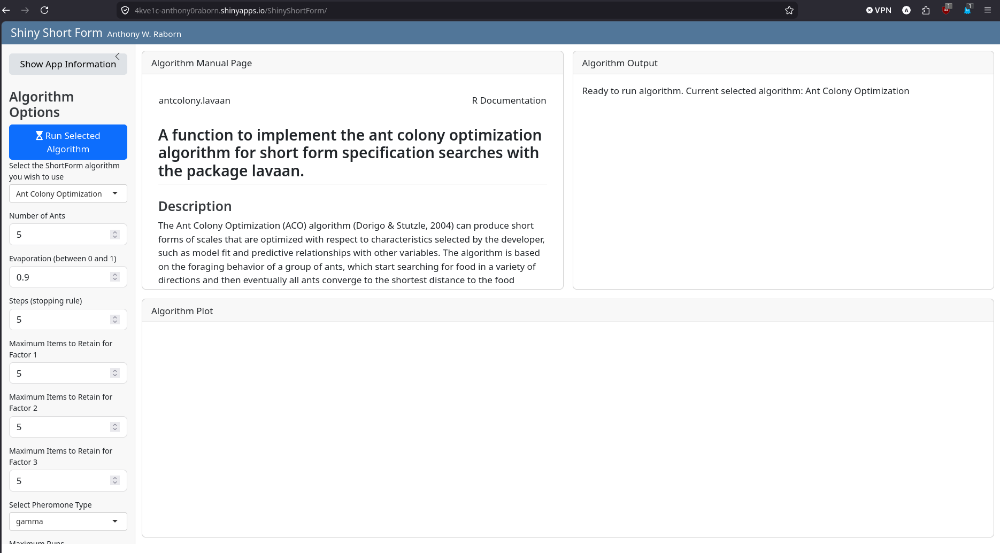

ShinyShortForm is a small app demonstrating the ShortForm package. It allows users to modify some of the parameters of the metaheuristic algorithms included in the package and see first-hand how they affect the runtime and output using simulated sample data.

As seen in this screenshot, the app provides the modifiable parameters on the lefthand side of the screen, as well as algorithm-specific informatino and output on the righthand side of the screen. For each of the algorithms (Ant Colony Optimization, Simulated Annealing, and Tabu Search), the parameter list automatically updates, as well as the manual page. You can press the "Run Selected Algorithm" button to use the default parameters, which result in a (relatively) quick run for each algorithm.

Each algorithm additionally has its own outputs and diagnostic plots that auto-populate after the algorithm has completed its run. The plots allow you to visually inspect how the algorithm searched for its proposed solution. If you modify the parameters, you can easily see how the search changes by keeping an eye on these diagnostic plots across runs.

Note that only a select set of parameters are modifiable on the app and there are restrictions on the values you can input for each parameter. However, you can still end up in a situation where the algorithm takes a long time to find a solution--that's expected! As long as the Algorithm Output is showing the ASCII animation, the application is working and you can expect a solution eventually.

Have any questions, comments, or ideas? Reach out and let us know!
